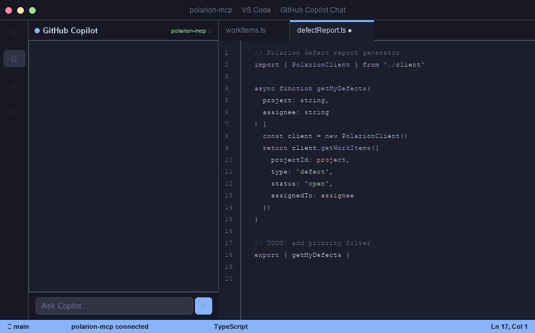
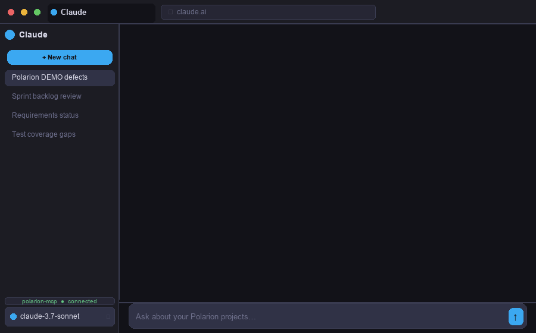

<div align="center">

# Polarion MCP

**Connect Claude, VS Code Copilot, and ChatGPT directly to Polarion ALM.**

An open-source **Model Context Protocol** server that exposes **271 Polarion REST operations** as AI-native tools.

[](https://github.com/phillipboesger/polarion-mcp/actions/workflows/ci.yml)
[](https://github.com/phillipboesger/polarion-mcp/actions/workflows/docker-publish.yml)
[](LICENSE)
[](package.json)
[](tsconfig.json)
[](https://github.com/phillipboesger/polarion-mcp/pkgs/container/polarion-mcp)
[](https://modelcontextprotocol.io)

[**Product page**](https://phillipboesger.github.io/polarion-mcp/) · [**Docs**](docs/README.md) · [**Docker image**](https://github.com/phillipboesger/polarion-mcp/pkgs/container/polarion-mcp)

</div>

<p align="center">
  
</p>

---

## Table of Contents

- [Features](#features)
- [Requirements](#requirements)
- [Getting Started](#getting-started)
  - [Docker (recommended)](#docker-recommended)
  - [Local development](#local-development)
- [Available Tools](#available-tools)
- [Configuration](#configuration)
- [Usage Examples](#usage-examples)
- [Architecture](#architecture)
- [Security](#security)
- [Contributing](#contributing)
- [Acknowledgements](#acknowledgements)
- [License](#license)

---

## Features

- **Strict Type Validation** — Zod schemas validate all inputs with Polarion query grammar support
- **Hardened Error Handling** — Standardized MCP errors with automatic token sanitization
- **Pagination Helpers** — Built-in utilities for easy result navigation
- **Security Checks** — Validates required environment variables and never logs sensitive data
- **Multiple Transports** — HTTP (Streamable MCP) and stdio support
- **CI/CD Ready** — TypeScript checks and automated Docker publishing included

---

## Requirements

- Node.js v20+
- Polarion Personal Access Token (PAT) with read permissions

---

## Getting Started

### Docker (recommended)

The image is published automatically to GitHub Container Registry on every push to `main`.

**HTTP mode** (VS Code Copilot, Claude.ai connector, any HTTP MCP client):

```bash
docker run -d \
  -e API_BASE_URL=https://your-polarion.com/polarion/rest/v1 \
  -e BEARER_TOKEN=your_polarion_pat \
  -e MCP_HTTP_TOKEN=your_mcp_secret \
  -p 3000:3000 \
  --name polarion-mcp \
  ghcr.io/phillipboesger/polarion-mcp:latest
```

Connect your MCP client to `http://localhost:3000/mcp` with `Authorization: Bearer your_mcp_secret`.

<p align="center">
  
</p>

**stdio mode** (VS Code, Claude Desktop):

```bash
docker run --rm -i \
  -e API_BASE_URL=https://your-polarion.com/polarion/rest/v1 \
  -e BEARER_TOKEN=your_polarion_pat \
  ghcr.io/phillipboesger/polarion-mcp:latest \
  node build/index.js
```

### Local development

```bash
npm install
cp .env.example .env
# edit .env — set API_BASE_URL, BEARER_TOKEN, MCP_HTTP_TOKEN
npm run dev:http      # starts MCP HTTP transport on :3000
```

See `docs/examples.http` for ready-to-run HTTP requests and `docs/client-example.ts` for a complete Node.js client example.

---

## Available Tools

271 tools are generated from the Polarion OpenAPI spec. A few representative examples:

| Tool | Description |
|---|---|
| `getAllWorkItems` | List work items across a project |
| `getWorkItem` | Fetch a specific work item by ID |
| `getAllDocuments` | List documents in a project |
| `getDocument` | Get a specific document |
| `postWorkItems` | Create new work items |
| `patchWorkItem` | Update an existing work item |

All tools accept an optional `rawPath` parameter to override REST endpoint paths without code changes — useful when your Polarion version uses non-standard paths.

The full list is generated from `src/tools.ts` via `npm run generate-tools`.

---

## Configuration

### Environment Variables

```bash
# Required
API_BASE_URL=https://your-polarion.com/polarion/rest/v1
BEARER_TOKEN=your_polarion_personal_access_token

# Required for HTTP MCP transport
MCP_HTTP_TOKEN=your_mcp_bearer_token   # clients must send this to /mcp

# Optional
MCP_HTTP_PORT=3000                     # port for MCP HTTP server (default 3000)
MCP_ALLOWED_HOSTS=your-host.com        # DNS-rebinding protection (comma-separated)
NODE_TLS_REJECT_UNAUTHORIZED=0         # disable SSL verification for self-signed certs
```

---

## Usage Examples

### Node.js client

```typescript
import { Client } from "@modelcontextprotocol/sdk/client/index.js";
import { StreamableHTTPClientTransport } from "@modelcontextprotocol/sdk/client/streamableHttp.js";

const client = new Client({ name: "my-client", version: "1.0.0" });
await client.connect(
  new StreamableHTTPClientTransport(new URL("http://localhost:3000/mcp"), {
    requestInit: { headers: { Authorization: "Bearer your_mcp_secret" } },
  })
);

const result = await client.callTool({
  name: "getAllWorkItems",
  arguments: { projectId: "MYPROJECT", query: "status:open", pageSize: 10 },
});
```

### Pagination

All list operations support `pageSize` and `pageStartIndex` parameters:

```typescript
const page1 = await client.callTool({
  name: "getAllWorkItems",
  arguments: { projectId: "MYPROJECT", query: "status:open", pageSize: 50, pageStartIndex: 0 },
});
```

---

## Architecture

```
src/
  config.ts           — API base URL, token, and resource URL constants
  server.ts           — shared MCP server factory (transport-agnostic)
  tools.ts            — generated MCP tool definitions (271 tools)
  executor.ts         — tool call dispatcher
  mcp-http-server.ts  — Streamable HTTP MCP transport (remote clients)
  http-server.ts      — plain REST wrapper for ChatGPT Custom GPT Actions
  index.ts            — stdio entry point (local MCP clients)
  polarion.ts         — resource and prompt handlers
  auth.ts             — authentication helpers
  utils.ts            — shared utilities
```

**Design notes:**

- Tools are auto-generated from the Polarion OpenAPI spec via `npm run regenerate`.
- REST paths may differ across Polarion versions. Every tool supports `rawPath` to override endpoints without code edits.
- No caching by design. Retries only on 429/5xx with short backoff.
- Bearer token is automatically sanitized from all logs and error messages.

---

## Security

- **Token Validation** — MCP HTTP server refuses to start without `MCP_HTTP_TOKEN`; every `/mcp` request must supply it as a Bearer token
- **Credential isolation** — Polarion credentials (`API_BASE_URL`, `BEARER_TOKEN`) stay server-side and are never exposed to MCP clients
- **DNS-rebinding protection** — optional `MCP_ALLOWED_HOSTS` allow-list validates the `Host` header on every request
- **No Secrets in Logs** — tokens are automatically removed from all log output and error messages

---

## Contributing

Contributions are welcome. To get started:

```bash
npm install
npm run typecheck      # TypeScript check
npm run build          # compile to build/
npm run dev:http       # run locally
```

To regenerate tools from the latest Polarion OpenAPI spec:

```bash
npm run regenerate     # downloads spec, generates tools, builds, and tests
```

Please open an issue before submitting a larger change so we can discuss the approach. Pull requests should include a description of what changed and why.

---

## Acknowledgements

🙏 Thanks to [@Jonasdero](https://github.com/Jonasdero), whose work is the foundation this MCP server builds on.

---

## License

[MIT](LICENSE) © Phillip Bösger
