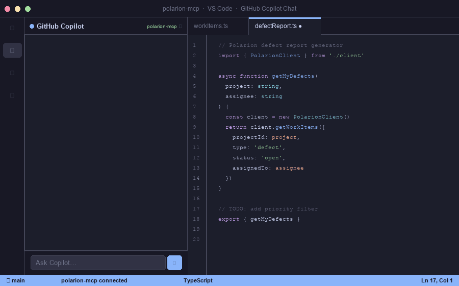

<div align="center">

# Polarion MCP

**Connect Claude, VS Code Copilot, and ChatGPT directly to Polarion ALM.**

An open-source **Model Context Protocol** server that exposes **284 Polarion REST operations** as AI-native tools.

[](https://github.com/phillipboesger/polarion-mcp/actions/workflows/ci.yml)
[](https://github.com/phillipboesger/polarion-mcp/actions/workflows/docker-publish.yml)
[](LICENSE)
[](package.json)
[](tsconfig.json)
[](https://github.com/phillipboesger/polarion-mcp/pkgs/container/polarion-mcp)
[](https://modelcontextprotocol.io)

[**Product page**](https://phillipboesger.github.io/polarion-mcp/) · [**Docs**](docs/README.md) · [**Docker image**](https://github.com/phillipboesger/polarion-mcp/pkgs/container/polarion-mcp)

</div>

<p align="center">
  
</p>

---

## Table of Contents

- [Features](#features)
- [Requirements](#requirements)
- [Getting Started](#getting-started)
  - [Choose an auth method](#choose-an-auth-method)
  - [Why two URLs?](#why-two-urls)
  - [Prerequisites](#prerequisites)
  - [A. Local stdio + PAT](#a-local-stdio--pat)
  - [B. HTTP server + PAT header](#b-http-server--pat-header)
  - [C. HTTP server + OAuth login](#c-http-server--oauth-login)
  - [D. REST wrapper + API key (ChatGPT)](#d-rest-wrapper--api-key-chatgpt)
  - [E. Custom GPT + OAuth login](#e-custom-gpt--oauth-login)
  - [Local development](#local-development)
- [Available Tools](#available-tools)
- [Configuration](#configuration)
- [Usage Examples](#usage-examples)
- [Architecture](#architecture)
- [Security](#security)
- [Contributing](#contributing)
- [Acknowledgements](#acknowledgements)
- [License](#license)

---

## Features

- **Strict Type Validation** — Zod schemas validate all inputs with Polarion query grammar support
- **Hardened Error Handling** — Standardized MCP errors with automatic token sanitization
- **Pagination Helpers** — Built-in utilities for easy result navigation
- **Security Checks** — Validates required environment variables and never logs sensitive data
- **Multiple Transports** — HTTP (Streamable MCP) and stdio support
- **CI/CD Ready** — TypeScript checks and automated Docker publishing included

---

## Requirements

- Node.js v20+
- Polarion Personal Access Token (PAT) with read permissions

---

## Getting Started

### Choose an auth method

Every method ends at a Polarion Personal Access Token (PAT). They differ in
where that token lives and which clients can use them.

| Method | Token lives | Use it for |
|---|---|---|
| [A. Local stdio + PAT](#a-local-stdio--pat) | in the client's MCP config on your machine | Claude Code, Claude Desktop (local server), VS Code Copilot. One user, no server to run. |
| [B. HTTP server + PAT header](#b-http-server--pat-header) | sent by the client on every request | Claude Code, VS Code Copilot, curl, scripts. Clients that can set a static `Authorization` header. |
| [C. HTTP server + OAuth login](#c-http-server--oauth-login) | pasted once on a login page, then held by the client, encrypted | Claude.ai, Claude Desktop and mobile, ChatGPT connectors (they cannot send custom headers). Also works for Claude Code and VS Code. |
| [D. REST wrapper + API key](#d-rest-wrapper--api-key-chatgpt) | one shared PAT in the server's environment | ChatGPT Custom GPT Actions. Every caller acts as the same Polarion user. |
| [E. Custom GPT + OAuth login](#e-custom-gpt--oauth-login) | pasted once on a login page, then held by ChatGPT, encrypted | ChatGPT Custom GPT Actions, each user under their own Polarion account. |

B, C and E run the same server: `MCP_PUBLIC_URL` adds the login on top of B,
and `GPT_CLIENT_ID`/`GPT_CLIENT_SECRET` add the Custom GPT login on top of C,
so one deployment can serve all three.

### Why two URLs?

- **`API_BASE_URL`** is where Polarion's REST API lives, e.g.
  `https://polarion.example.com/polarion/rest/v1` (always ending in
  `/polarion/rest/v1`). The server *calls* it. Required by every method.
- **`MCP_PUBLIC_URL`** is this server's own public address as clients see it,
  e.g. `https://mcp.example.com` (origin only, no path). Only method C needs
  it. Behind a TLS proxy the process only sees `http://127.0.0.1:3000`, yet the
  OAuth metadata it publishes must contain absolute HTTPS URLs the client can
  reach (issuer, `/authorize`, `/token`, `/register`). The server does not
  guess this from the request's `Host` header, because a spoofed header would
  then change the issuer.

The client never needs `API_BASE_URL`. For B and C it only gets the connector
URL: the server's public origin plus `/mcp`.

### Prerequisites

- Polarion with the REST API enabled
  (`com.siemens.polarion.rest.enabled=true` in `polarion.properties`).
- A Polarion PAT per user: Polarion, *My Account > Personal Access Tokens*.
  The token carries the user's own permissions.
- Node.js 20+ **or** Docker. From source:

  ```bash
  git clone https://github.com/phillipboesger/polarion-mcp.git
  cd polarion-mcp
  npm ci            # also runs the build
  ```

### A. Local stdio + PAT

The client starts the server as a subprocess; nothing listens on the network.

1. Build from source (see Prerequisites) or pull the image:
   `docker pull ghcr.io/phillipboesger/polarion-mcp:latest`.
2. Register it with your client:

   **Claude Code**

   ```bash
   claude mcp add polarion \
     -e API_BASE_URL=https://polarion.example.com/polarion/rest/v1 \
     -e BEARER_TOKEN=<your-polarion-pat> \
     -- node /absolute/path/to/polarion-mcp/build/index.js
   ```

   **Claude Desktop** (`claude_desktop_config.json`, then restart the app)

   ```json
   {
     "mcpServers": {
       "polarion": {
         "command": "node",
         "args": ["/absolute/path/to/polarion-mcp/build/index.js"],
         "env": {
           "API_BASE_URL": "https://polarion.example.com/polarion/rest/v1",
           "BEARER_TOKEN": "<your-polarion-pat>"
         }
       }
     }
   }
   ```

   **VS Code Copilot** (`.vscode/mcp.json`; VS Code prompts for the token and stores it securely)

   ```json
   {
     "inputs": [
       { "type": "promptString", "id": "polarion-pat", "description": "Polarion PAT", "password": true }
     ],
     "servers": {
       "polarion": {
         "type": "stdio",
         "command": "node",
         "args": ["/absolute/path/to/polarion-mcp/build/index.js"],
         "env": {
           "API_BASE_URL": "https://polarion.example.com/polarion/rest/v1",
           "BEARER_TOKEN": "${input:polarion-pat}"
         }
       }
     }
   }
   ```

   **With Docker instead of Node**, replace the command in any of the above with:

   ```bash
   docker run --rm -i \
     -e API_BASE_URL=https://polarion.example.com/polarion/rest/v1 \
     -e BEARER_TOKEN=<your-polarion-pat> \
     ghcr.io/phillipboesger/polarion-mcp:latest \
     node build/index.js
   ```

3. Verify: in Claude Code run `/mcp` (server shows *connected*), then ask
   "list my Polarion projects".

### B. HTTP server + PAT header

One shared server that holds **no** credentials; each client sends its own PAT.

**Server**

1. Start it. The image runs the Streamable HTTP MCP server by default:

   ```bash
   docker run -d --name polarion-mcp \
     -e API_BASE_URL=https://polarion.example.com/polarion/rest/v1 \
     -e MCP_ALLOWED_HOSTS=mcp.example.com \
     -p 127.0.0.1:3000:3000 \
     ghcr.io/phillipboesger/polarion-mcp:latest
   ```

   From source: `MCP_HTTP_HOST=127.0.0.1 API_BASE_URL=... npm run start:mcp-http`.
2. Put TLS in front of it (reverse proxy forwarding `/mcp` to
   `127.0.0.1:3000`). The PAT travels in a header, so never expose the
   plaintext port. For a Polarion server's own Apache, see
   [docs/deployment.md](docs/deployment.md).
3. Verify:

   ```bash
   curl -s https://mcp.example.com/health
   curl -si -X POST https://mcp.example.com/mcp \
     -H 'authorization: Bearer <your-polarion-pat>' \
     -H 'content-type: application/json' \
     -H 'accept: application/json, text/event-stream' \
     -d '{"jsonrpc":"2.0","id":1,"method":"initialize","params":{"protocolVersion":"2025-06-18","capabilities":{},"clientInfo":{"name":"curl","version":"1"}}}' \
     | head -1        # HTTP/1.1 200
   ```

**Clients**

- **Claude Code**

  ```bash
  claude mcp add --transport http polarion https://mcp.example.com/mcp \
    --header "Authorization: Bearer <your-polarion-pat>"
  ```

- **VS Code Copilot** (`.vscode/mcp.json`)

  ```json
  {
    "inputs": [
      { "type": "promptString", "id": "polarion-pat", "description": "Polarion PAT", "password": true }
    ],
    "servers": {
      "polarion": {
        "type": "http",
        "url": "https://mcp.example.com/mcp",
        "headers": { "Authorization": "Bearer ${input:polarion-pat}" }
      }
    }
  }
  ```

- **Your own code**: see [Usage Examples](#usage-examples).

Claude.ai and Claude Desktop connectors cannot set a header; use C for them.

### C. HTTP server + OAuth login

Same server as B plus `MCP_PUBLIC_URL`. A client connecting without a token
gets a `401` pointing at the login; the user pastes their PAT once, the server
checks it against Polarion and hands the client tokens that carry the PAT
encrypted under `MCP_TOKEN_SECRET`. The server stores nothing; only it can
read the tokens.

**Server**

1. Pick the public HTTPS hostname. It must be reachable **from where the
   client connects**: Claude.ai and Claude Desktop/mobile connectors connect
   from Anthropic's cloud, so the host must be reachable from the internet (a
   VPN- or intranet-only host will not work). Claude Code and VS Code connect
   from your own machine, so an internal host is fine for them.
2. Start it:

   ```bash
   docker run -d --name polarion-mcp \
     -e API_BASE_URL=https://polarion.example.com/polarion/rest/v1 \
     -e MCP_PUBLIC_URL=https://mcp.example.com \
     -e MCP_TOKEN_SECRET=$(openssl rand -base64 48) \
     -e MCP_ALLOWED_HOSTS=mcp.example.com \
     -p 127.0.0.1:3000:3000 \
     ghcr.io/phillipboesger/polarion-mcp:latest
   ```

   The log must show `OAuth login enabled at https://mcp.example.com/authorize`.
   Store `MCP_TOKEN_SECRET` like a password and keep it fixed: it is what lets
   logins survive restarts and redeploys (and must be the same on every
   instance behind a load balancer). Changing it logs everyone out.
3. Configure the TLS reverse proxy to forward **all** of these paths, or the
   login breaks mid-flow: `/mcp`, `/authorize`, `/token`, `/register`,
   `/polarion-login`, `/.well-known/oauth-authorization-server`,
   `/.well-known/oauth-protected-resource` (prefix match), and for method E
   also `/gpt/` and `/api/tools` plus `/openapi-gpt.json`. A dedicated hostname
   that forwards `/` entirely is simplest. The paths live at the root, so the
   server cannot sit under a sub-path such as `https://host/polarion-mcp`.
   Apache block for the Polarion host: [docs/deployment.md](docs/deployment.md).
4. Verify:

   ```bash
   # 401 with WWW-Authenticate: this is what makes a client offer the login
   curl -si -X POST https://mcp.example.com/mcp \
     -H 'content-type: application/json' \
     -H 'accept: application/json, text/event-stream' \
     -d '{"jsonrpc":"2.0","id":1,"method":"initialize","params":{}}' | grep -i www-authenticate
   curl -s https://mcp.example.com/.well-known/oauth-protected-resource/mcp
   curl -s https://mcp.example.com/.well-known/oauth-authorization-server
   ```

   Every URL in the two JSON documents must start with `https://mcp.example.com`.

**Clients**

- **Claude.ai** (also syncs to Claude Desktop and mobile): *Settings >
  Connectors > Add custom connector*, name it, URL
  `https://mcp.example.com/mcp`, leave *OAuth Client ID/Secret* empty (the
  client registers itself). Click *Connect*, paste your PAT on the page that
  opens, click *Connect* again. On Team/Enterprise plans an owner may have to
  add the connector for the organization first.
- **Claude Code**: `claude mcp add --transport http polarion https://mcp.example.com/mcp`,
  then run `/mcp`, select `polarion`, *Authenticate*; the login page opens in
  your browser.
- **ChatGPT** (Plus/Pro/Business/Enterprise): *Settings > Security and login*,
  turn on *Developer mode* (on Business/Enterprise an admin may have to allow
  custom connectors first). Then add a custom connector / app with URL
  `https://mcp.example.com/mcp` and authentication *OAuth*; leave client ID
  and secret empty, ChatGPT registers itself. Paste your PAT on the page that
  opens.
- **VS Code Copilot**: add the server as in B but without `headers`; VS Code
  asks you to authenticate on first use.

**How long a login lasts:** as long as Polarion accepts the PAT. The client
renews its access token silently every hour; each renewal re-checks the PAT
with Polarion, so revoking the PAT (or its expiry date passing) ends the
login at the next renewal and the user is asked to log in again. A server
restart does not log anyone out as long as `MCP_TOKEN_SECRET` stays the same.
There is no per-session logout: to cut off one user, revoke their PAT in
Polarion; to cut off everyone, change `MCP_TOKEN_SECRET`.

### D. REST wrapper + API key (ChatGPT)

A plain REST surface for Custom GPT Actions, not MCP. It uses **one** PAT for
all callers; there is no per-user login.

1. Start it:

   ```bash
   docker run -d --name polarion-rest \
     -e API_BASE_URL=https://polarion.example.com/polarion/rest/v1 \
     -e BEARER_TOKEN=<service-account-pat> \
     -e HTTP_API_KEY=$(openssl rand -hex 32) \
     -p 127.0.0.1:3000:3000 \
     ghcr.io/phillipboesger/polarion-mcp:latest \
     node build/http-server.js
   ```

2. Publish it over HTTPS (reverse proxy), then check
   `curl -s https://gpt.example.com/health`.
3. In the GPT editor: *Configure > Actions > Create new action > Import from
   URL* `https://gpt.example.com/openapi-gpt.json` (30-tool subset that fits
   ChatGPT's limit). *Authentication*: API Key, Auth Type *Bearer*, paste the
   `HTTP_API_KEY` value.

### E. Custom GPT + OAuth login

The Custom GPT Action logs every user in with their own PAT, like C. It runs
on the C server; Actions cannot do the automatic client registration or PKCE
that connectors use, so the GPT gets a fixed client id and secret and its own
two endpoints.

**Server**

1. Set up C, including `MCP_TOKEN_SECRET`. The host must be reachable from
   the internet (ChatGPT calls it from OpenAI's cloud).
2. Add a client id and secret for the GPT and restart:

   ```bash
   -e GPT_CLIENT_ID=polarion-gpt \
   -e GPT_CLIENT_SECRET=$(openssl rand -hex 32)
   ```

   The log must show `Custom GPT OAuth enabled: authorize https://mcp.example.com/gpt/authorize, ...`.
3. Forward `/gpt/`, `/api/tools` and `/openapi-gpt.json` in the reverse proxy
   too (see C step 3).

**GPT editor**

1. *Configure > Actions > Create new action > Import from URL*
   `https://mcp.example.com/openapi-gpt.json`.
2. *Authentication > OAuth*:

   | Field | Value |
   |---|---|
   | Client ID | the `GPT_CLIENT_ID` value |
   | Client Secret | the `GPT_CLIENT_SECRET` value |
   | Authorization URL | `https://mcp.example.com/gpt/authorize` |
   | Token URL | `https://mcp.example.com/gpt/token` |
   | Scope | `polarion` |
   | Token Exchange Method | Default (POST request) or Basic authorization header; both work |

3. Save. The server only accepts ChatGPT's own callbacks
   (`https://chatgpt.com/aip/<gpt-id>/oauth/callback`), so there is nothing
   to allowlist.
4. Test: in the GPT preview ask "list my Polarion projects", click *Sign in
   with mcp.example.com*, paste your PAT. Later calls run silently until the
   PAT is revoked or expires.

### Local development

```bash
npm ci
cp .env.example .env   # set API_BASE_URL; BEARER_TOKEN only for stdio / REST mode
npm run build
npm run start:mcp-http # Streamable HTTP MCP server on :3000
```

See `docs/examples.http` for ready-to-run HTTP requests and `docs/client-example.ts` for a complete Node.js client example.

---

## Available Tools

284 tools are generated from the Polarion OpenAPI spec. A few representative examples:

| Tool | Description |
|---|---|
| `getAllWorkItems` | List work items across a project |
| `getWorkItem` | Fetch a specific work item by ID |
| `getAllDocuments` | List documents in a project |
| `getDocument` | Get a specific document |
| `postWorkItems` | Create new work items |
| `patchWorkItem` | Update an existing work item |

All tools accept an optional `rawPath` parameter to override REST endpoint paths without code changes — useful when your Polarion version uses non-standard paths.

The full list is generated from `src/tools.ts` via `npm run generate-tools`.

---

## Configuration

### Environment Variables

```bash
# Required
API_BASE_URL=https://your-polarion.com/polarion/rest/v1

# Required for stdio and REST (ChatGPT) mode only. The MCP HTTP server ignores it:
# each client sends its own PAT
BEARER_TOKEN=your_polarion_personal_access_token

# Optional
MCP_HTTP_PORT=3000                     # port for MCP HTTP server (default 3000)
MCP_HTTP_HOST=127.0.0.1                # bind address (default 0.0.0.0); use loopback behind a TLS proxy
MCP_PUBLIC_URL=https://mcp.example.com # public HTTPS origin (no path); enables the OAuth login page
MCP_ALLOWED_HOSTS=your-host.com        # DNS-rebinding protection (comma-separated)
MCP_TOKEN_SECRET=...                   # min. 32 chars; keeps OAuth logins valid across restarts (keep it fixed)
GPT_CLIENT_ID=polarion-gpt             # Custom GPT OAuth client (method E), with GPT_CLIENT_SECRET
GPT_CLIENT_SECRET=...
NODE_TLS_REJECT_UNAUTHORIZED=0         # disable SSL verification for self-signed certs
```

---

## Usage Examples

### Node.js client

```typescript
import { Client } from "@modelcontextprotocol/sdk/client/index.js";
import { StreamableHTTPClientTransport } from "@modelcontextprotocol/sdk/client/streamableHttp.js";

const client = new Client({ name: "my-client", version: "1.0.0" });
await client.connect(
  new StreamableHTTPClientTransport(new URL("http://localhost:3000/mcp"), {
    requestInit: { headers: { Authorization: "Bearer your_polarion_pat" } },
  })
);

const result = await client.callTool({
  name: "getAllWorkItems",
  arguments: { projectId: "MYPROJECT", query: "status:open", pageSize: 10 },
});
```

### Pagination

All list operations support `pageSize` and `pageStartIndex` parameters:

```typescript
const page1 = await client.callTool({
  name: "getAllWorkItems",
  arguments: { projectId: "MYPROJECT", query: "status:open", pageSize: 50, pageStartIndex: 0 },
});
```

---

## Architecture

```
src/
  config.ts           — API base URL, token, and resource URL constants
  server.ts           — shared MCP server factory (transport-agnostic)
  tools.ts            — generated MCP tool definitions (284 tools)
  executor.ts         — tool call dispatcher
  mcp-http-server.ts  — Streamable HTTP MCP transport (remote clients)
  http-server.ts      — plain REST wrapper for ChatGPT Custom GPT Actions
  index.ts            — stdio entry point (local MCP clients)
  polarion.ts         — resource and prompt handlers
  auth.ts             — authentication helpers
  utils.ts            — shared utilities
```

**Design notes:**

- Tools are auto-generated from the Polarion OpenAPI spec via `npm run regenerate`.
- REST paths may differ across Polarion versions. Every tool supports `rawPath` to override endpoints without code edits.
- No caching by design. Retries only on 429/5xx with short backoff.
- Bearer token is automatically sanitized from all logs and error messages.

---

## Security

- **No stored credentials in HTTP mode** — the server keeps no Polarion token of its own; every `/mcp` request carries the caller's own Polarion PAT, or an access token from the OAuth login that carries the PAT encrypted under `MCP_TOKEN_SECRET` (the client cannot read it), and Polarion authorizes each call under that user
- **Serve it over TLS** — the PAT travels in the request header; terminate TLS in front of the server and bind the plaintext port to loopback (`MCP_HTTP_HOST=127.0.0.1`)
- **DNS-rebinding protection** — optional `MCP_ALLOWED_HOSTS` allow-list validates the `Host` header on every request
- **No Secrets in Logs** — tokens are automatically removed from all log output and error messages

---

## Contributing

Contributions are welcome. To get started:

```bash
npm install
npm run typecheck      # TypeScript check
npm run build          # compile to build/
npm run dev:http       # run locally
```

To regenerate tools from the latest Polarion OpenAPI spec:

```bash
npm run regenerate     # downloads spec, generates tools, builds, and tests
```

Please open an issue before submitting a larger change so we can discuss the approach. Pull requests should include a description of what changed and why.

### Releasing

Releases are automated by [`.github/workflows/release.yml`](.github/workflows/release.yml):

1. Bump `"version"` in `package.json` and commit it to `main`.
2. Tag the commit and push the tag: `git tag vX.Y.Z && git push origin vX.Y.Z`.
3. The workflow builds, tests, and packages the release ZIP, then publishes a GitHub Release for the tag with notes auto-generated from the pull requests merged since the previous tag (from the start of the history for the first release).

---

## Acknowledgements

🙏 Thanks to [@Jonasdero](https://github.com/Jonasdero), whose work is the foundation this MCP server builds on.

---

## License

[MIT](LICENSE) © Phillip Bösger
